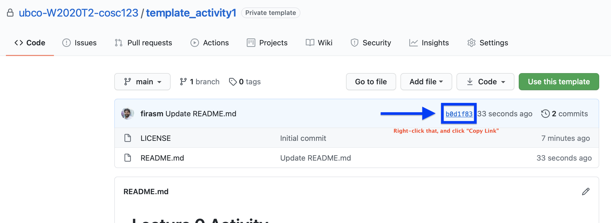

# Lecture 1 Activity - Zee 123

In this lecture 1 activity, I will ask you to do several things:

## Activity 1A

1. Copy the `activity.md` file from Lecture0-activity to this directory

1. From a Terminal, Use the `mv` commands to move an image file from somewhere on your computer to this directory. 

1. In your `activity.md` file, paste the command using [triple back-ticks to mark it as code](https://www.markdownguide.org/cheat-sheet/).

1. Add, commit, then push your changes to GitHub.com

1. Then follow the instructions in class to create and resolve a merge conflict.

1. Once you're done, submit a link to this repository (not a specific commit) to Canvas.

## Activity 1B - Reproduce this structure in your repository

The files should be named teh same way, but you can leave them empty if you want.

You will need the following commands:

- [`cd`](https://man7.org/linux/man-pages/man1/cd.1p.html) : change directory
- [`pwd`](https://man7.org/linux/man-pages/man1/pwd.1.html) : print working directory
- [`mkdir`](https://man7.org/linux/man-pages/man1/mkdir.1.html): make directory
- [`ls`](https://man7.org/linux/man-pages/man1/ls.1.html): list directory contents
- [`touch`](https://man7.org/linux/man-pages/man1/touch.1.html): create an empty file with a specific name
- `code`/`pico`/`nano`/`vim`: edit the file in a text editor

1. Submit a link to this commit on Canvas. For example, to get the link to this commit, see this screenshot on how to do it:

    It will look something like this: `https://github.com/ubco-W2020T2-cosc111/template_activity0/commit/c53f212d4612121e1ebd83bb03965b8500f2f316`
