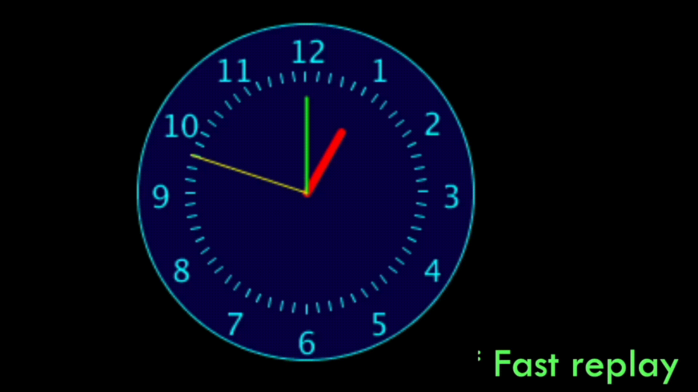

# Lecture 7 Activity

For each activity, within this README file, embed a screenshot of your code as well as the drawing that is generated after you run your code.

Similar to labs, you should be committing your code frequently!

## Task 1 - Analogue Clock Version 3

Update your version 2 of the analogue clock code from Lecture Activity 4 to look similar to the given figure. 

[Download the starter code](./clock_starter/clock_starter.pde) then use loops to
  * Put all the numbers from 1 to 12
  * Put all the little minute ticks (dashes) around the clock. 

Follow the instructions in the starter code to finish your animation.

Add a screenshot of your code and solution below this line:

## Task 2 - while Loops
Write code that uses **while loops** to generate the following sketches.

*Hint:* above sketches can be produced by drawing many adjacent circles (for A) or lines (for B) while slightly changing the color. For example, the illustrations below are the same as the above except that the spacing between the circles/lines is larger.

Add a screenshot of your code and solution below this line:

    
## Task 3 - for Loops
Repeat the previous task using **for** loops

Add a screenshot of your code and solution below this line:

## Task 4 - Loops and User Interactivity
A) Write code to show all colors as in the example below – note that the red color follows the mouse (hint: use HSB, refer to last program in pre_class notes)

B) Change your above code so that the output is similar to below

Add a screenshot of your code and solution below this line:

## Task 5 - Nested for Loops
A) Shiffman Exercise: 
  * Create a grid of squares, each colored randomly, using a for loop. 
  * Recode the same pattern using a while loop instead of for.
  

B) Generate the grid of squares in the lower figure. 
  * Note that each square is colored in a way that the window has a gradient shading.
each square has an outline that is slightly lighter in color than the fill color. 

Add a screenshot of your code and solution below this line:

## Task 6 - Bubble! (Optional - but highly recommended!)
Create a sketch in which a bubble (ellipse) moves from the bottom of the screen to the top while being blown by some imaginary, low-turbulence wind. The size should also slightly increase as the bubble moves up.

The idea:
  * Start with the bubble below the window bottom (y>height) – decrement y by 1 and increment radius by a small amount every frame.
  * Use Perlin noise (see Slide 86 from Lecture 4) to determine the x location

Add a screenshot of your code and solution below this line: