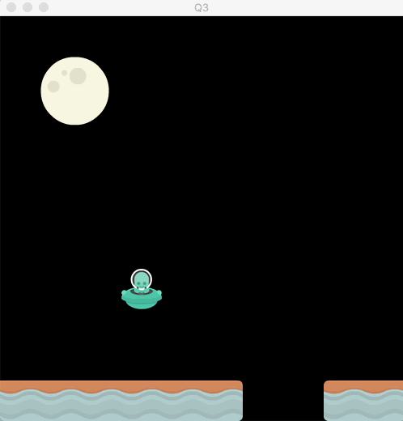

## Question 3 - Stop the alien before the platform (5 marks)

Start with the standard template in the Q3 directory.

Tasks: 

a) Use the constrain function to ensure that the alien does not cross the platform. 

b) Once it reaches the platform, it should disappear then reappear as normal

  

 

### Rubric:

- **2 marks** for using the constrain function correctly
- **2 marks** for the alien disappearing once reaching the platform
- **1 mark** for the alien reappearing after disappearing
