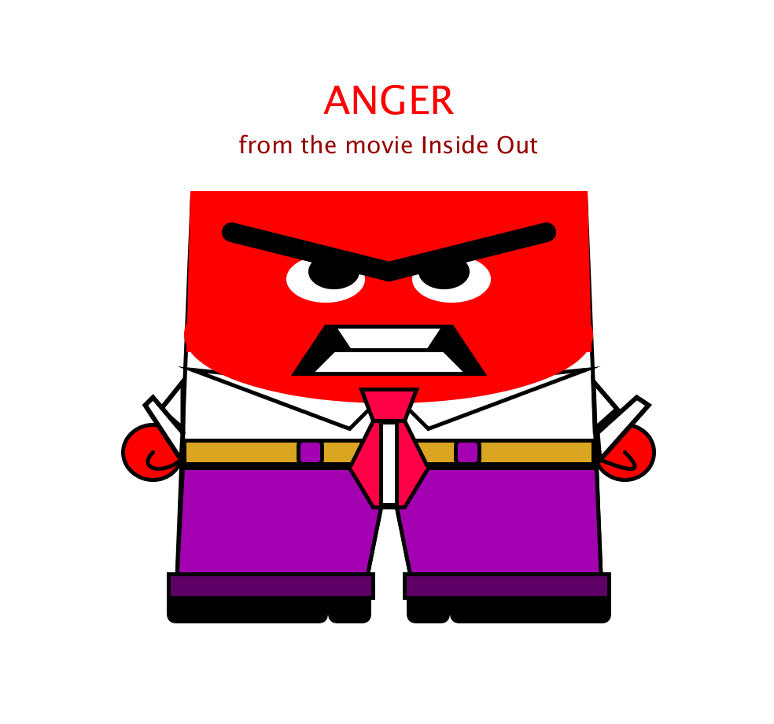

# Lab 3

In this lab, you will be practicing some basics of Processing such as primitive shapes, text, color, stroke attributes.

## Q1. Create a sketch

Often in Processing it is essential to have rough draft or sketch of your final product before you dive into your drawing.
It is not essential for your final Drawing in Processing to exactly match your rough draft (similar to the rough draft of an essay or presentation), but it does help to have a "North Star" to guide you on your Processing journey.

In this task, **create a sketch of a Processing drawing you want to create using pen/pencil and paper**, or a tablet, or other drawing program such as [SketchPad](https://sketch.io/sketchpad/), Paint, etc...
Be creative, think beyond what we did in Lecture Activity 2 (character).
There will be bonus marks (maximum Lab mark is 100%) given for creativity and sophistication, but keep in mind the majority of the marks awarded will be for following the requirements (see Marking Requirements section).

Please embed a screenshot or exported image of your draft sketch using pen/pencil and paper**, or a tablet, or other drawing program.

> 
## Q2. Turn your sketch into a Processing Drawing

Now that you have a sketch, you can convert your sketch into a Processing Drawing.

[Link to my PDE File](./lab3/lab3.pde).

> 

We are expecting you to commit your work often with useful commit messages.
This means that **at least** 5 points while you work, you should commit and push your changes to the repository.
Repositories that have very few commits will be flagged for careful scrutiny and review, and you will **definitely** lose marks for this!

## Marking Requirements: 

This question is worth 30 marks distributed as follows:

1) +5 The sketch must be meaningful and non-trivial (5 marks)
2) +5 for sketch that close-enough to your paper-based design. (up to -3 if paper design is not submitted) 
3) +2 for using a bezier curve.
4) +6 for using at least 3 different types of primitive shapes (in addition to Bezier).
5) +3 for using 2 different RGB colors.
6) +3 for using 2 different HSB colors.
7) +3 for including text in your design.
8) +3 for using different stroke weights and colors.

Up to +5 bonus marks for distinguished work (e.g. better designs, complex compositions, better colors).

## Submission Instructions 

For this Lab, you need to do the following: 

1. Upload a screenshot of your draft sketch to this repo.
1. Create a file called lab1.pde in this repo (this will contain your Processing drawing code)
1. Link your screenshot to this README file.
1. Link your lab1.pde file in this README fie.
1. Submit your repo URL to Canvas before the deadline (we will mark the last commit before the deadline)