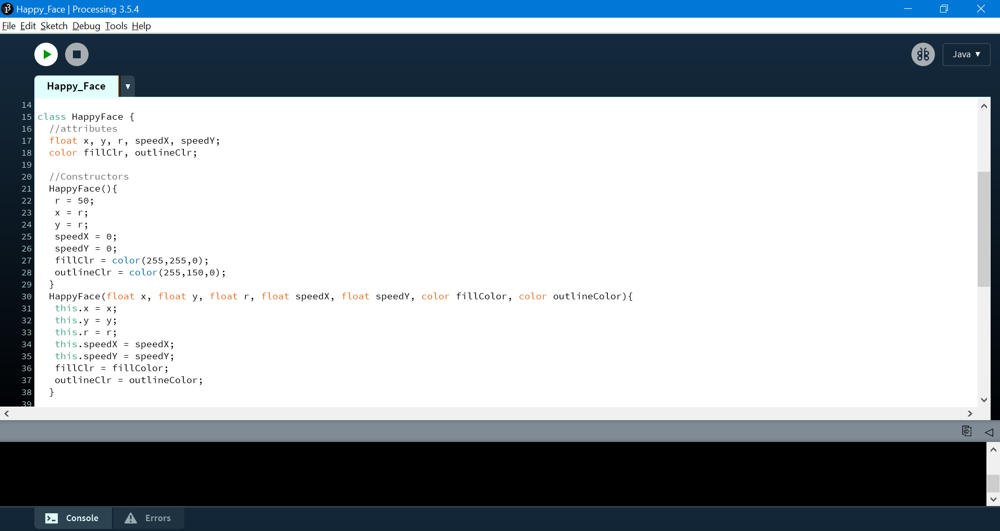
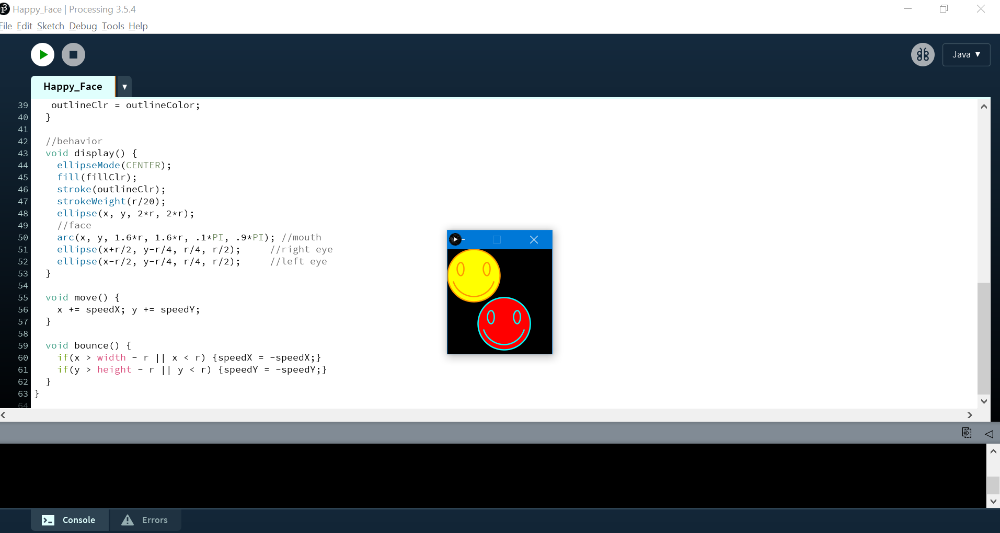
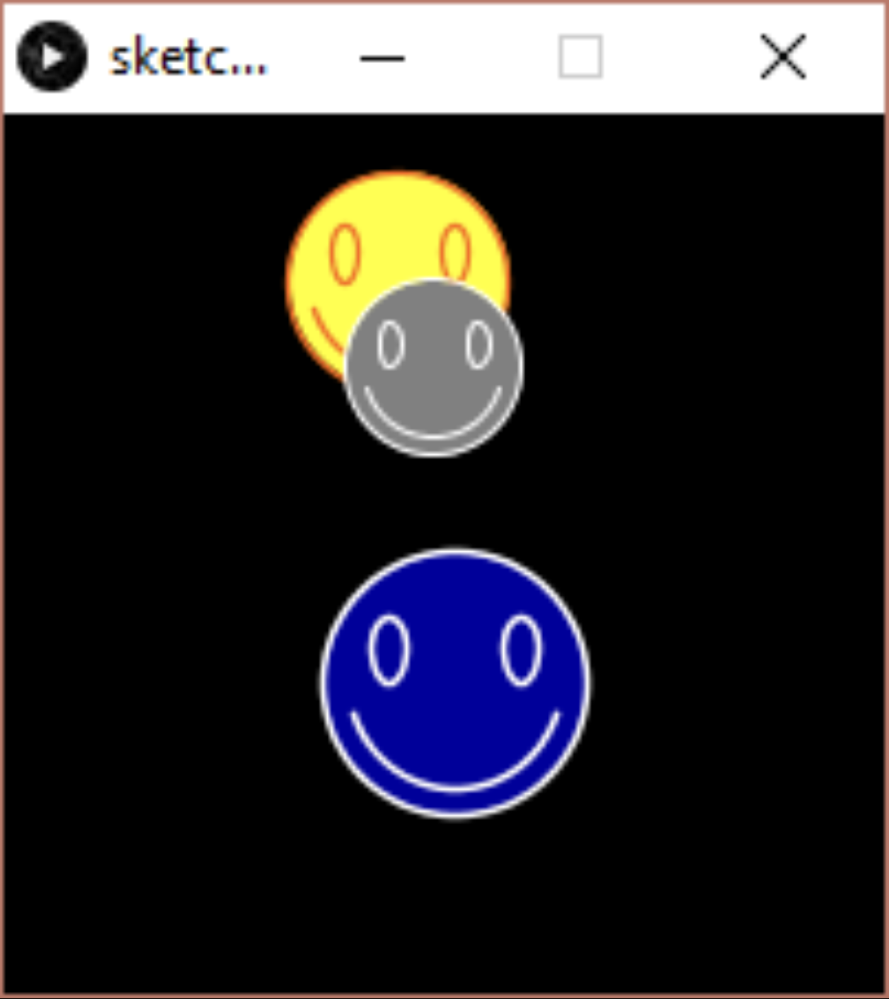
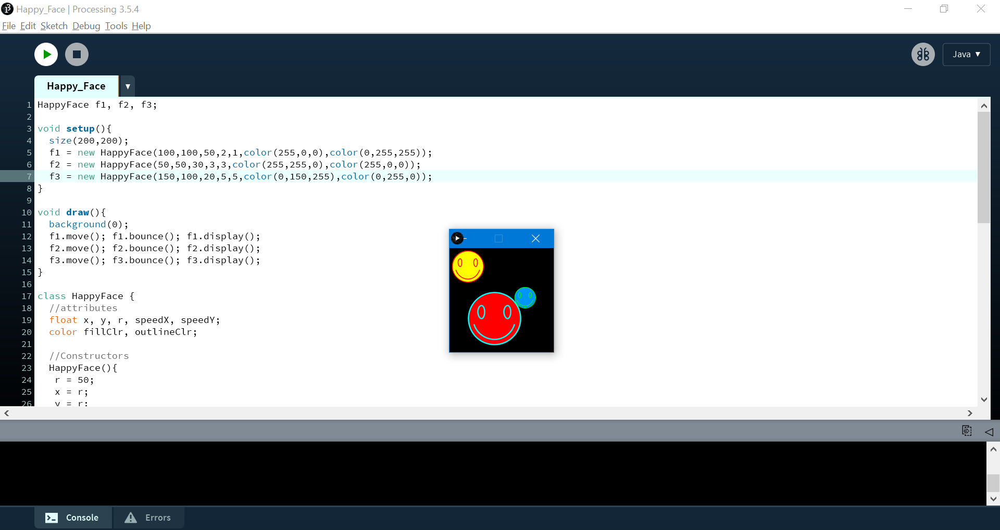

# Lecture 10 Activity

For each activity, within this README file, embed a screenshot of your code as well as the drawing that is generated after you run your code.

## Task 1 - Add Constructors to HappyFace Class

- Modify your HappyFace class from the last lecture activity so that it has two constructors:
  - A zero-argument constructor that sets the radius to 50, the (x,y) position to (radius,radius), speedX and speedY to 0, fill color to yellow, outline color to orange.
  - A seven-arg constructor that sets the attributes to given values.





## Task 2 - Bouncing Happy Face(s)

- Create three bouncing happy-faces with different positions, size and speed, and then move, bounce, and display them in the draw() function. 
- Notice how easy it is to create many objects now of the same class and use them in your program.
```
HappyFace f1, f2, f3;

void setup(){
  size(200,200);
  f1 = new HappyFace(...);
  //do the same for f2,f3
}

void draw(){
  background(0);
  f1.move;  f1.bounce(); f1.display();
  //do the same for f2,f3
}

class HappyFace{...}
```




It's a short lecture activity this week!
