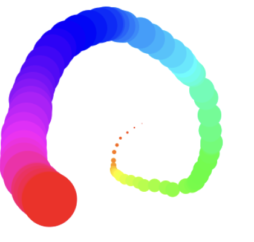
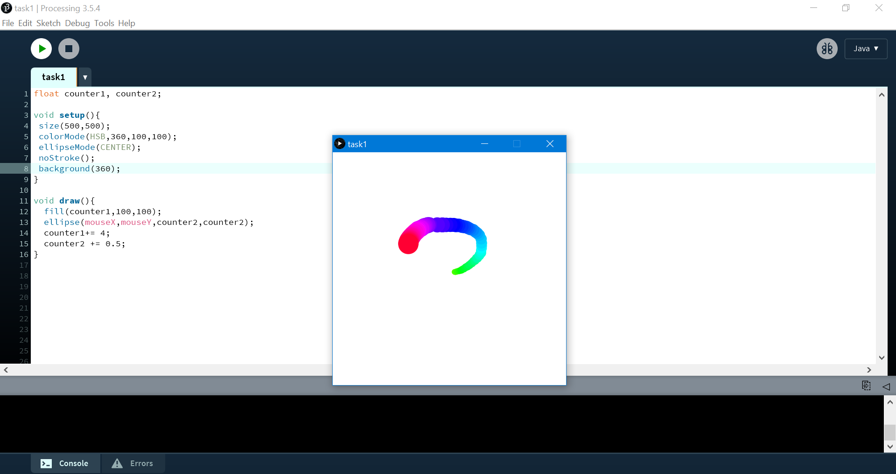
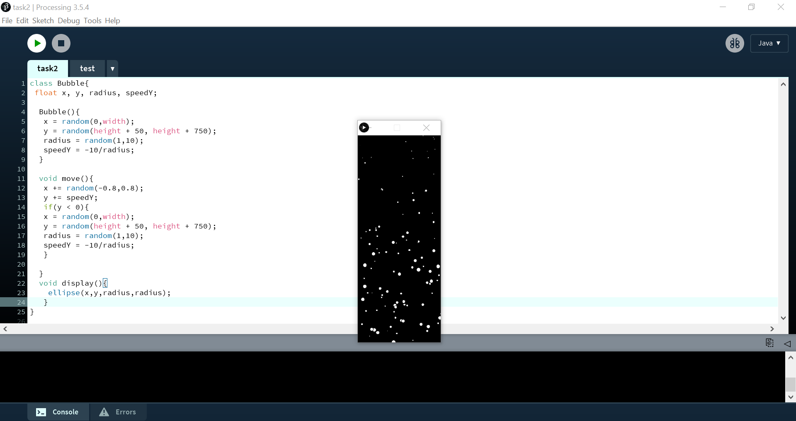
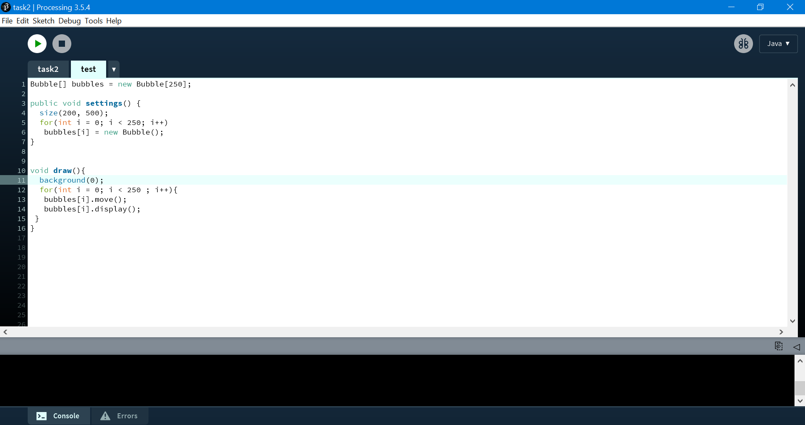
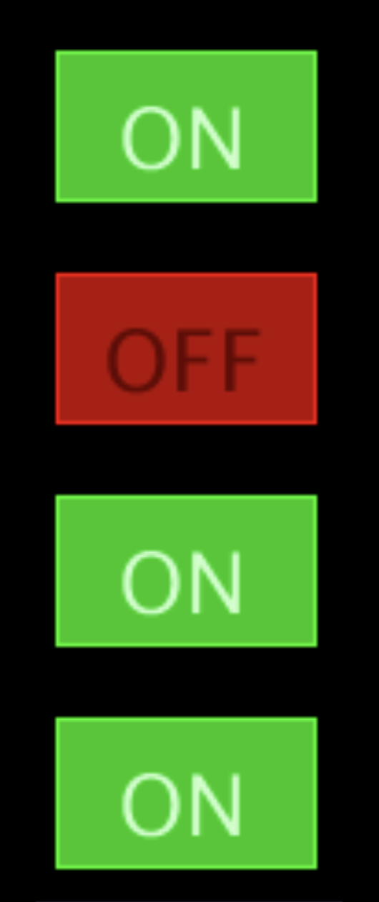
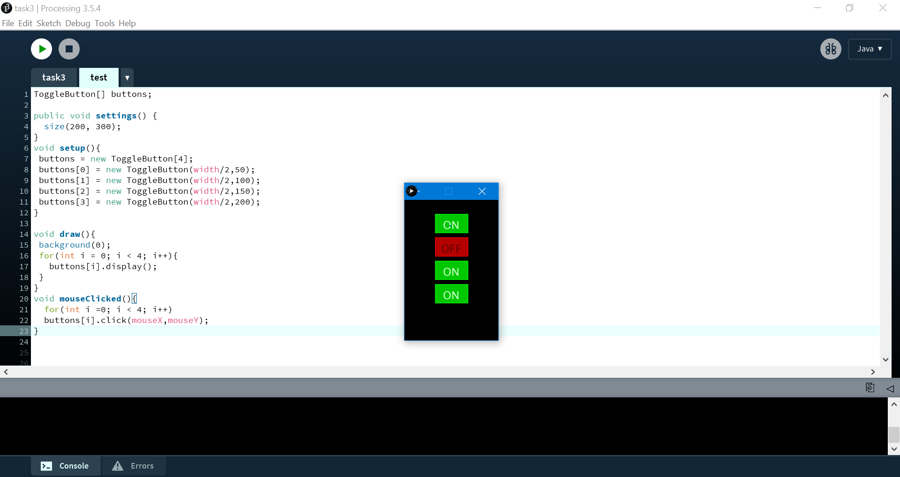

# Lecture 11 Activity

For each activity, within this README file, embed a screenshot of your code as well as the drawing that is generated after you run your code.

## Task 1 - Can you produce the following output?


Add a screenshot of your code and solution below this line:


## Task 2 - Bubbles in My Bottle
Create the animation of bubbles rising in a bottle:
- Create a bubble class
   - Attributes: x,y,radius,speedY
   - Constructor: 
     - x = random value from 0 to the sketch width
     - y = random value from height+50 to height+750
     - radius = random value from 1 to 10
     - speedY = -10/radius
   - move() function:  
     - x-location randomly changes within -0.8 and 0.8
     - y-location is incremented speedY 
     - Once a bubble goes above the top edge of the sketch, its attributes are assigned new set of random values (similar to how they were set in the constructor).
   - Display() function
     - Draw an ellipse representing the bubble.

Create an array with 250 bubbles, then move and display them in the animation loop.
*Challenge: Make sure we only have a maximum of 12 big bubbles at any time (size of bubbles: small is from 1 to 3, big is 10 to 15)*

It should look like [this](./mov1.mp4)

Add a screenshot of your code and solution below this line:




## Task 3 - Array of Buttons
Create an array of 4 buttons arranged vertically where each button maintains its own state.
Using the ToggleButton class below:



```
class ToggleButton {
 float x, y, w, h;  //x,y are the center of the button
 String onTxt, offTxt;
 boolean on = false, mouseOver = false;
 ToggleButton(float x,float y) {this(x,y,70,40,"ON","OFF");}
 ToggleButton(float x,float y,float w,float h,String onTxt,String offTxt){
   this.x = x;     this.y = y;    this.w = w;    this.h = h;
   this.onTxt = onTxt;     this.offTxt = offTxt;
 }
 void click(int mx, int my) {
   if(mx>x-w/2 && mx<x+w/2 && my>y-h/2 && my<y+h/2) on = !on;
 }
 void display() {
   rectMode(CENTER); textAlign(CENTER,CENTER); textSize(w/3);
   if (on) {
     stroke(0, 255, 0);   fill(0, 200, 0);  rect(x, y, w, h);
     fill(200, 255, 200); text("ON", x, y);
   } else {
     stroke(255, 0, 0);   fill(180, 0, 0);  rect(x, y, w, h);
     fill(100, 0, 0);     text("OFF", x, y);
   }
 }
}

```
```
void mouseClicked(){btn.click(mouseX,mouseY);}
```
Add a screenshot of your code and solution below this line:



## And that's it! Congratulations, you are done with all of the Lecture Activities!
