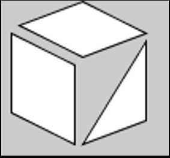
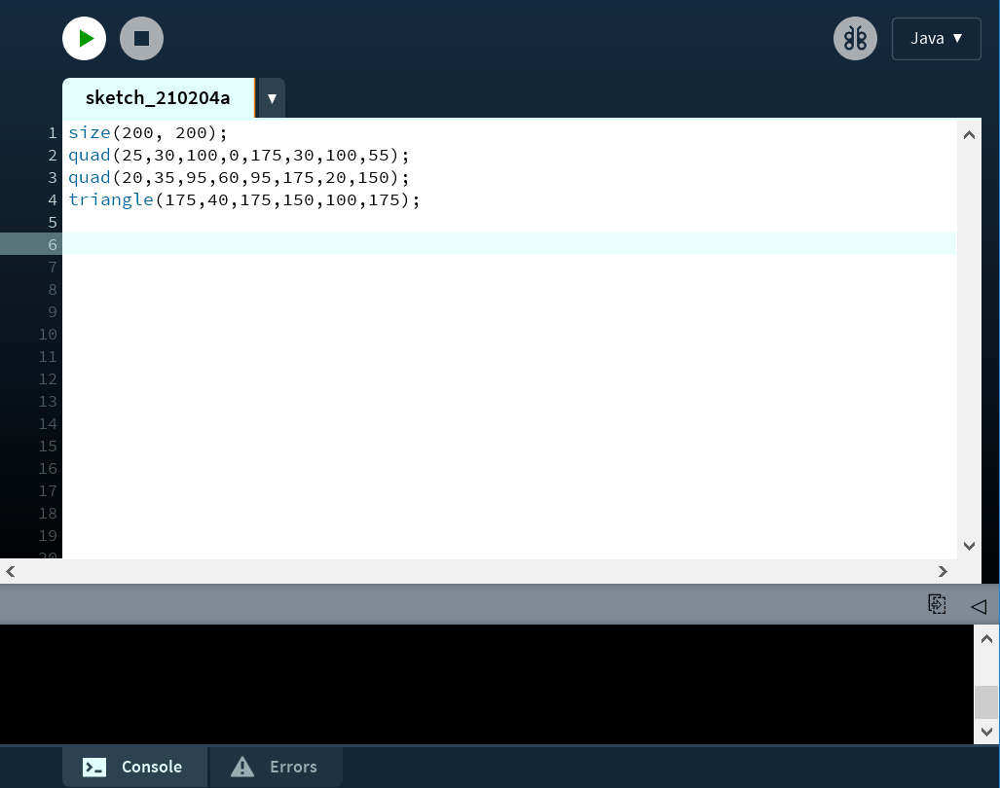
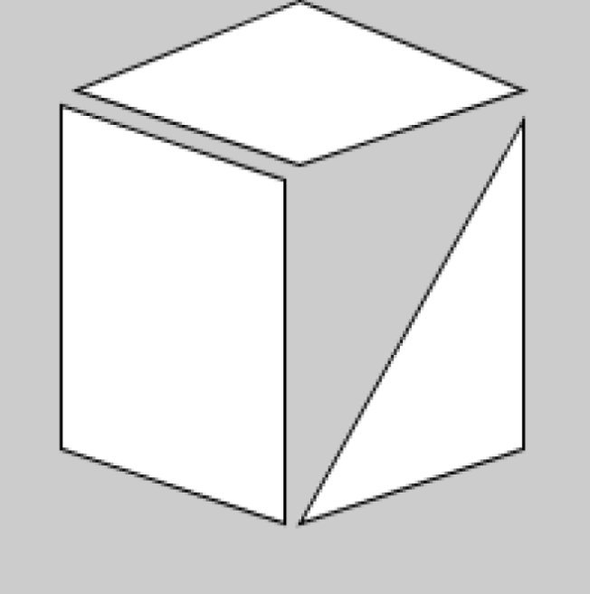
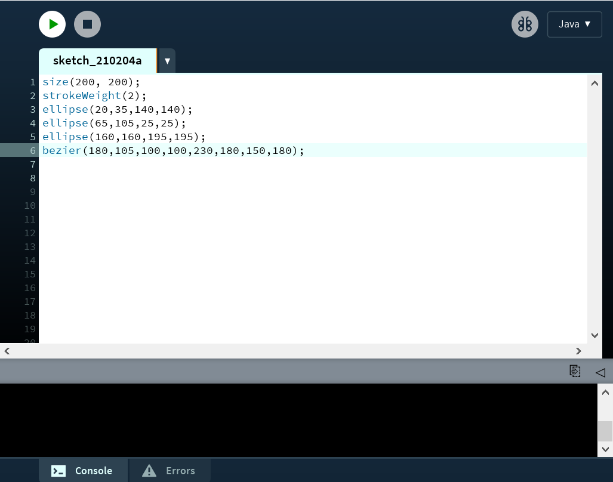
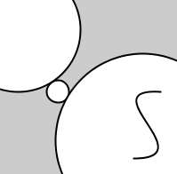
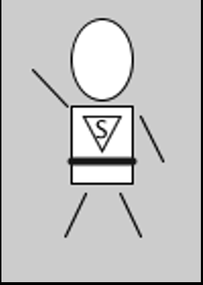
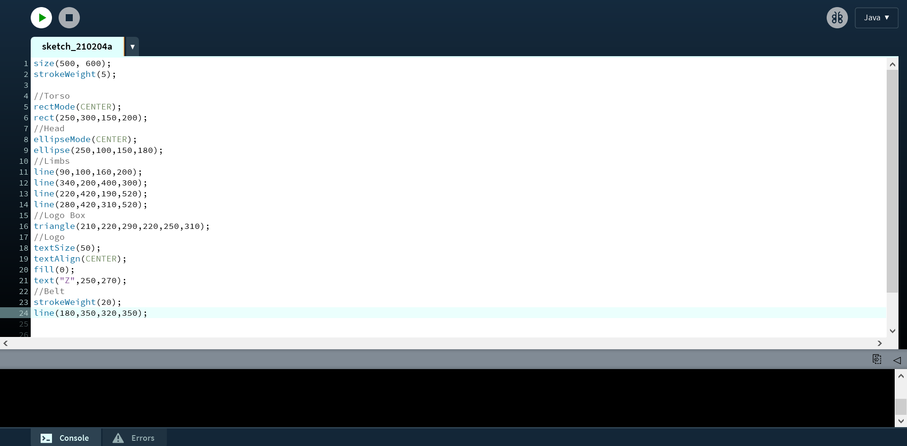
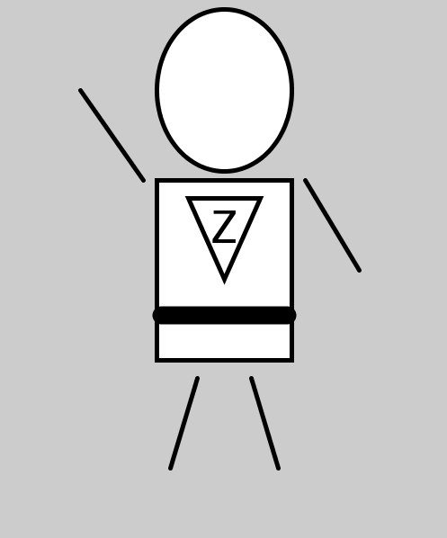

# Lecture 2 Activity

In this lecture 2 activity, you will make your first sketches in processing!

For each activity, within this README file, embed a screenshot of your code as well as the drawing that is generated after you run your code.

## Task 1 - Rectangles and Triangles

Using your knowledge of drawing shapes, write code in the PDE to draw the following sketch (assume reasonable dimensions):

*Hint: It may help to sketch your drawing on paper first, then try to figure out the coordinates, and then write code.*

Add a screenshot of your code and solution below this line:

## Task 2 - Ellipses and Beziers

Using your knowledge of drawing shapes, write code in the PDE to draw the following sketch (assume reasonable dimensions):

*Hint: It may help to sketch your drawing on paper first, then try to figure out the coordinates, and then write code.*

Add a screenshot of your code and solution below this line:

## Task 3 - Put it all together

Write code to design a simple character that looks something like this:

We will use this character throughout the semester in other exercises
so, try to be creative! 
You can add and update this character later too so don't stress too much about getting things perfect! 

No need to worry about color at this point, we will talk about that next week.

Use the easiest drawing mode for aligning your body parts. 
For example, it would be easier if we use the CENTER drawing mode for the torso.

Include the following items in your character sketch:
- A belt (stroke with larger width)
- A logo on the character chest. 
- The design must have at least one character of text.

*Hint: It may help to break down your character into multiple simpler shapes by sketching your drawing on paper first, then try to figure out the coordinates, and then write code.*

Add a screenshot of your code and solution below this line:

