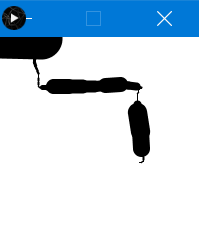

# Lecture 3 Activity

In this lecture activity, you will be improving upon the character you made in the last lecture activity.

For each activity, within this README file, embed a screenshot of your code as well as the drawing that is generated after you run your code.

## Task 1 - Apply Colour to your character

Using your knowledge of colour to add a splash of colour to your character.
You should re-use your PDE file from Lecture Activity 2. 
Remember, you can copy a file using the Terminal:

```
cp path\to\file1.pde path\to\copiedfile1.pde
```

Include the following items in your character sketch:

- Change the colour of the circle representing your face
- Change the outline of your face to be slightly darker than the face colour
- Change the colour of your belt
- Change the colour of your "clothes"

Add a screenshot of your code and solution below this line:


## Task 2 - Move your character
You should re-use your PDE file from Lecture Activity 3 Task 1. 

- Add code to your program so that the character moves with your mouse cursor. 

*Hint: the location of all shapes of your character should depend on mouseX and mouseY*

Add a screenshot of your code and solution below this line:


## Task 3 - More practice with mouse events

This code is is used to draw a continuous line:

```
void setup() {
  size(200, 200);
  background(255);
  stroke(0);}
void draw() {
  //... add code here ...
  line(pmouseX, pmouseY, mouseX, mouseY );
}
```

Copy this into a new PDE file called `task3.pde`. 

Modify the code so that the thickness of the line is controlled by the mouse speed. 
Here are some hints:

Mouse Speed is the distance the mouse travel per unit of time. 
Therefore, speed can be computed in terms of the distance the mouse travels in each new frame.
In other words, the difference between the current mouse position and previous one.
Use abs() function to avoid negative values. 
Don’t worry too much about having super accurate calculations. 

Add a screenshot of your code and solution below this line:




## Task 4 - Moving YOUR Character using transform()

Previously (in Task 2), you moved your character by adding mouseX and mouseY to every (x,y) of all shapes in your character. 
Today, we will move the character using a simpler technique.

1) duplicate your character code from Task 1 and call it `task4.pde`
2) add one statement at the beginning to move (translate) your character. 


