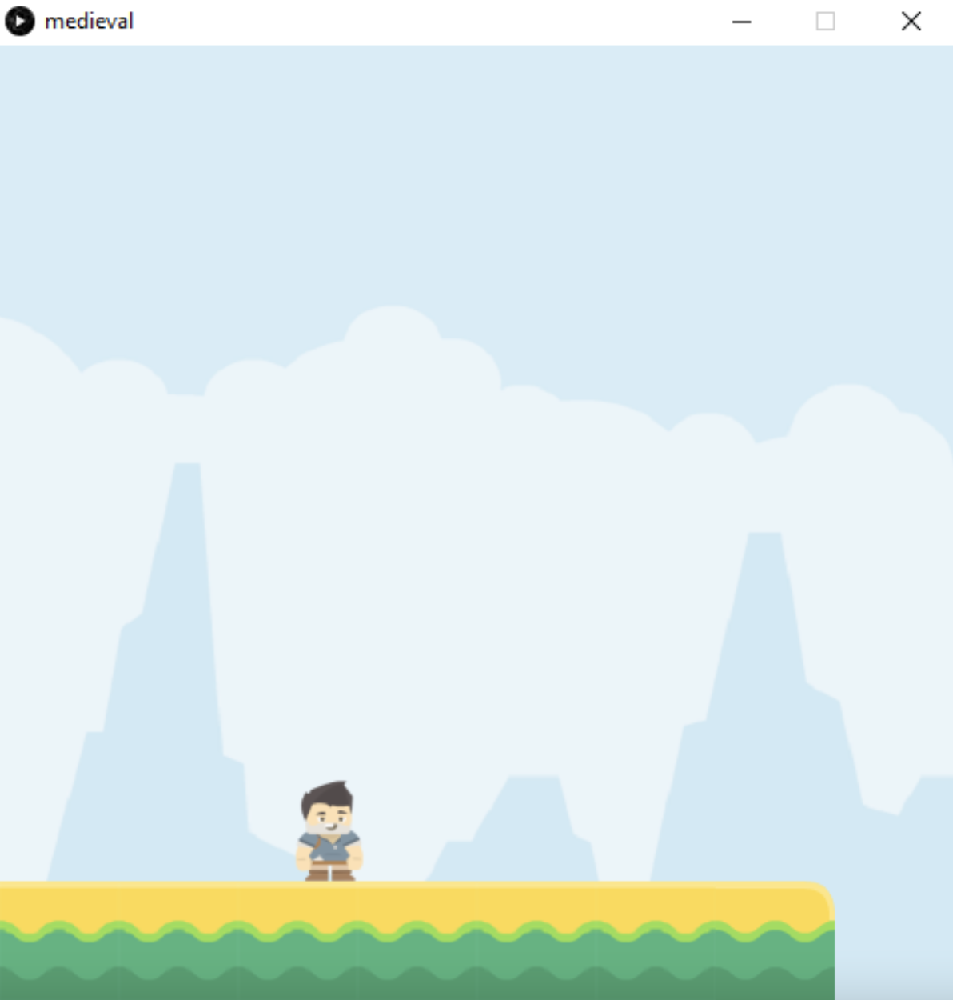

# Lecture 6 Activity

In this lecture activity, you will be improving upon the character you made in the last lecture activity.

For each activity, within this README file, embed a screenshot of your code as well as the drawing that is generated after you run your code.

## Task 1 - Draw a Game Platform

In this exercise, we will build a game platform using a few tiles that can be used as “Lego pieces”.
 * All tiles have the same width & height (64 x 64)
 * Tiles need to be loaded into separate variables (e.g. img1, img2, …), and then placed one by one on the sketch

Steps:
 * Use the [starter code](./medieval_starter).
 * Open in Processing.
 * Write the missing code as per the instructions in starter code.
 * The output should be similar to: 

 

Add a screenshot of your code and solution below this line:


## Task 2 - Move Your Player

In the last task, you created the game platform, you should re-use your PDE file for this (copy it and rename it `task2.pde`). 
Remember, you can copy a file using the Terminal:

```
cp path\to\file1.pde path\to\copiedfile1.pde
```

For this activity, do the following:  

  * Update your code so that the player moves left or right with the arrow keys.
  
The player should be moving as long as an arrow key is pressed and should stop moving if the key is released.

Add a screenshot of your code and solution below this line:


## Task 3 - Jump...Jump...

Previously, you created the game platform and added code to move the player left or right with the arrow keys. 
  * Open your solution from the previous exercise.
  * Add more code to make your player jump when SPACE is pressed. Note that a player cannot jump if already jumping

Add a screenshot of your code and solution below this line:


## Task 4 - The *map()* function
Using the map() function, draw a circle that follows the mouse cursor “to some extent”
To do this, you need to map:
  * mouseX to from range (0 to window width) to range (25% to 75% of the width), and
  * mouseY from range (0 to window height) to the range (25% to 75% of the height).
  
Add a screenshot of your code and solution below this line:


## Task 5 - The *constrain()* function
Repeat Task 4 but with the ball exactly following the mouse cursor as long as the mouse is within the dotted box (below). The ball cannot follow the mouse outside the box.
  * To do this, replace the map() function with a constrain() function.
  * (you don’t have to draw the dotted box)
  


Add a screenshot of your code and solution below this line:

