# Lecture 8 Activity

For each activity, within this README file, embed a screenshot of your code as well as the drawing that is generated after you run your code.

## Task 1 - Tint your Spaceship
```
void setup(){
 size(300,250);
}
void draw() {
 background(255);
 drawSpaceship(100,100,64);
 drawSpaceship(250,40,32);
 drawSpaceship(50,50,32);
 drawSpaceship(150,80,32);
 drawSpaceship(200,100,96);
}
void drawSpaceship(int x, int y, int size) {
 // draw side guns
 rectMode(CENTER);
 stroke(255, 90, 90);
 strokeWeight(1);
 fill(255, 0, 0);
 rect(x-size/3, y+size/2, size/15, size/3);
 rect(x+size/3, y+size/2, size/15, size/3);
 // draw jet engine
 fill(255, 180, 0);
 rect(x, y+size, size/2, size/10);
 // draw main body
 stroke(0);
 fill(0, 50, 155);
 triangle(x,y,x+size/2,y+size,x-size/2, y+size);
 fill(0, 100, 255);
 ellipse(x, y+2*size/3, size/3, size/2);
}
```
Modify drawSpaceship() function given above so that you can also control the brightness of the spaceship. For example, the following code should produce the output given below.
```
drawSpaceship(20,30,16,0);   //tiny spaceship
drawSpaceship(50,50,32,0.4);  //small spaceship
drawSpaceship(150,30,48,0.8); //medium spaceship
drawSpaceship(100,100,64,1.0); //big spaceship
```
  - E.g. brightness should be given as a number in the range of 0..1:
      0 means extremely dark (black silhouette), 1 means normal colors

*Hint:* multiply the brightness value by every color component in your function, e.g. fill(255) should be changed to fill(255\*brightness).

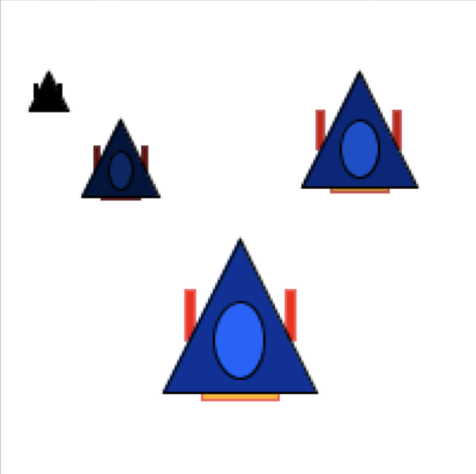

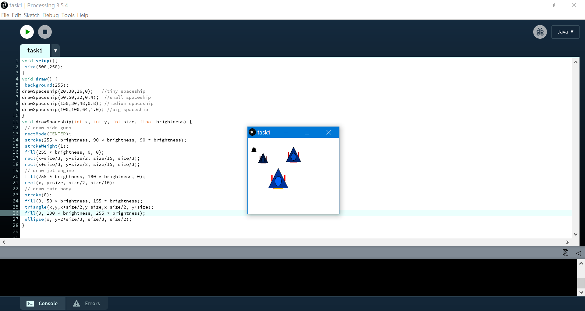

## Task 2 - Draw Your Character with Functions
For this task you should reuse your code from previous lecture activities. Remember, you can copy a file using the Terminal:

```
cp path\to\file1.pde path\to\copiedfile1.pde
```

Update your code so that the character is drawn in a function. The parameters should be the position, the scale, and the body and belt colors. Use this function to draw 2 or 3 of your character. 

Use this header: *drawSuperhero(int x,int y, float scale, color c1, color c2);*

*Hint:* whenever you transform the coordinates inside a function, it is better to restore the original coordinates before leaving the function. HOW can you do this?

Add a screenshot of your code and solution below this line:

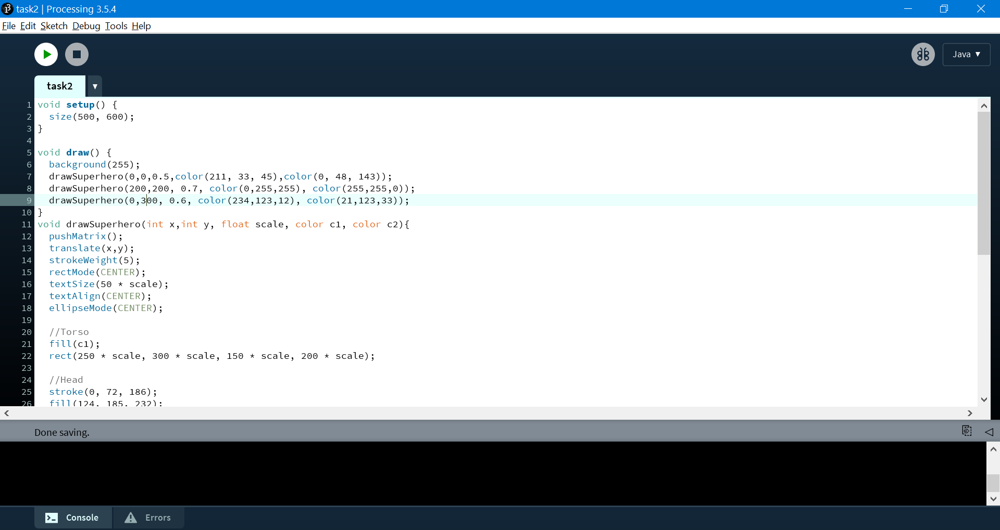
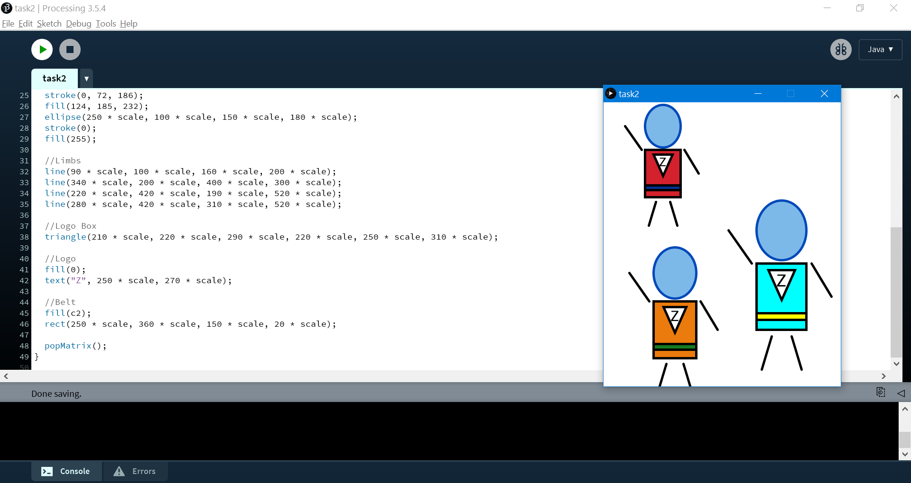
## Task 3 - Update your Game

* Download the [starter code](./medieval_withScenes) and unzip to your computer.
* Open any of the three files in Processing. 
  - You will notice all three files appear in 3 tabs.  
* Run the code (Ctrl+R) and observe the output.
  - This is the same “Player Jumping” exercise we did before.  
* Implement the following two requirements 
  - REQ1 : go to scene1 tab and use functions to organize your code (see the REQ comments in scene1).
  - REQ2: add one more scene, named scene0, in a new tab (press the triangle button beside scene1 tab to create a new tab). The new scene should be the game’s opening screen with the message “Hit ‘P’ to play, and ‘E’ to exit. Hit ‘M’ during gameplay to return to this screen”. You will need to update the keyReleased function with the following:
    * if(we are in scene 0 and player hits P) then go to scene 1
    * if(we are in scene 0 and player hits E) then exit()
    * if(we are in scene 1 and player hits M) then go to scene 0

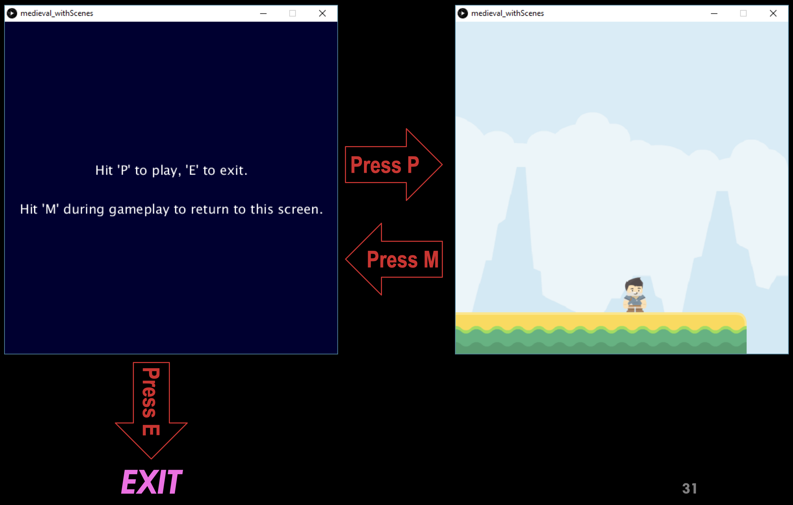

Add a screenshot of your code and solution below this line:

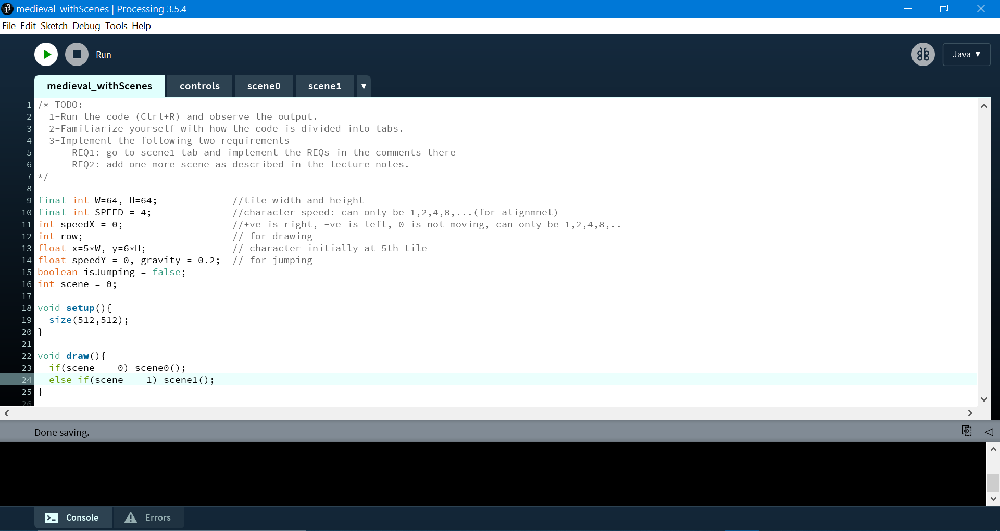
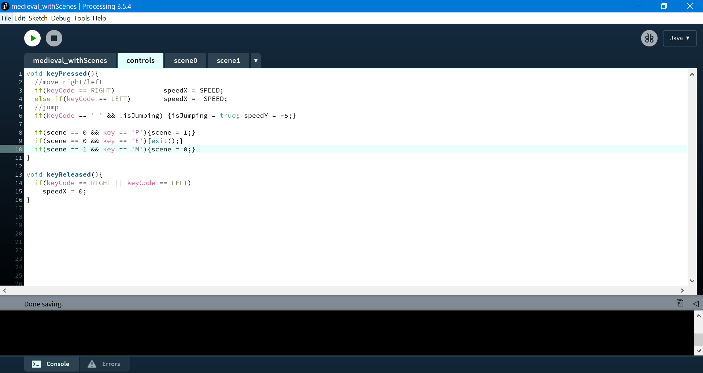
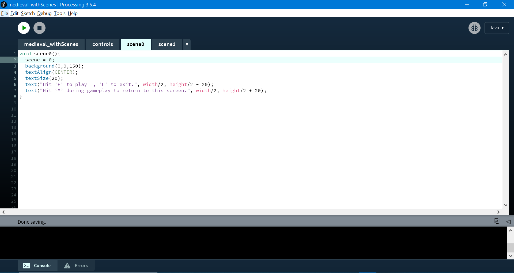
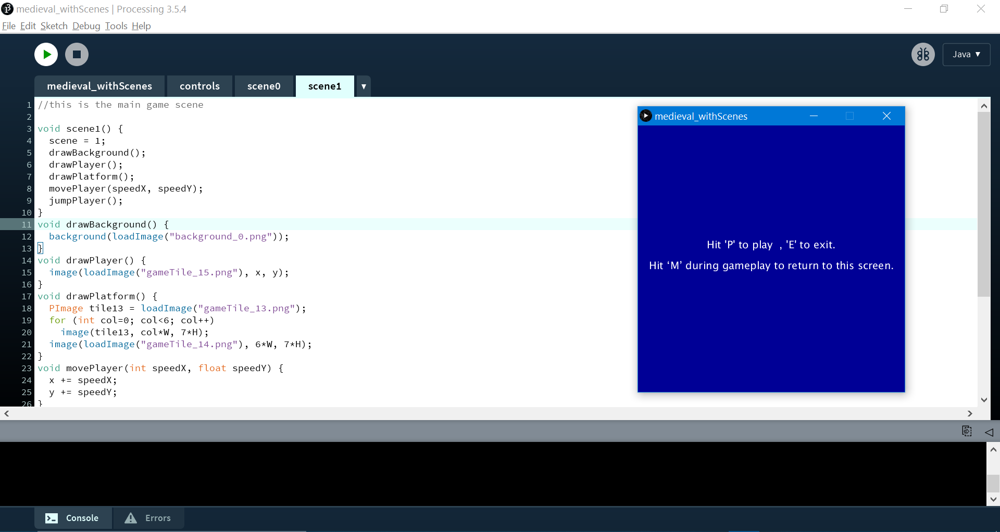
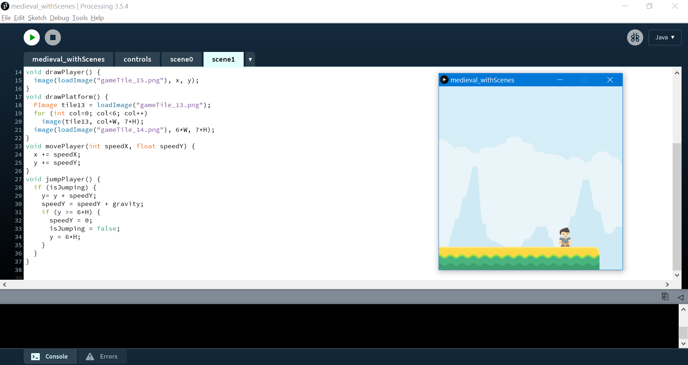

## Task 4 - Be Creative...

* Expand the code from Task 1 to include any one of the following items:
  - Improve game items (spaceships and bullet)
      - e.g. replace with images, use better vector designs (e.g. enemy should be more than just a moving dull circle), etc.
  - Change the code so that the enemy follows one of three predefined paths every time it enters the window from the top. The chosen path should be selected randomly.
      - Define 3 paths: sinusoidal, noise(), and diagonal. Each time the enemy enters the screen, it randomly selects one of the 3 paths and follows it until either it exits the screen (from the bottom) or it is shot.
  - Allow your spaceship to shoot another bullet (total of 2 bullets).
       
Add a screenshot of your code and solution below this line:

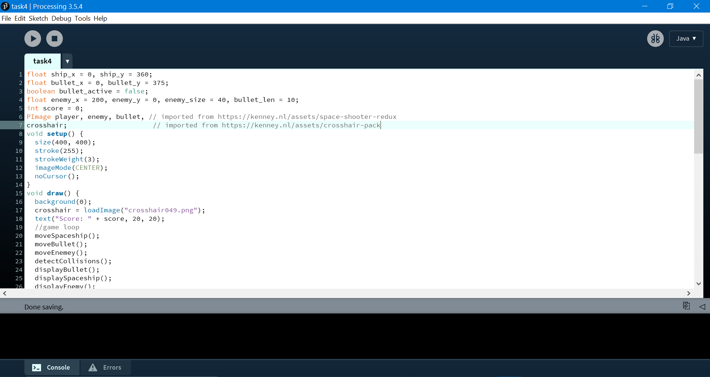
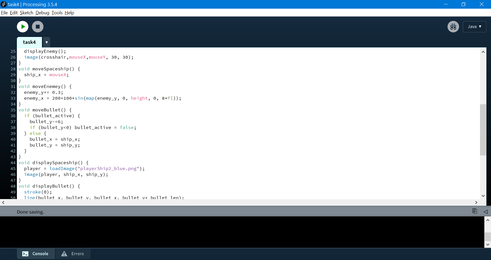
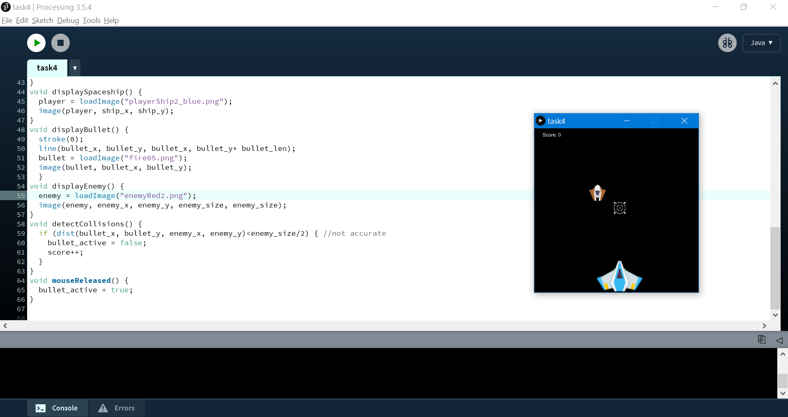