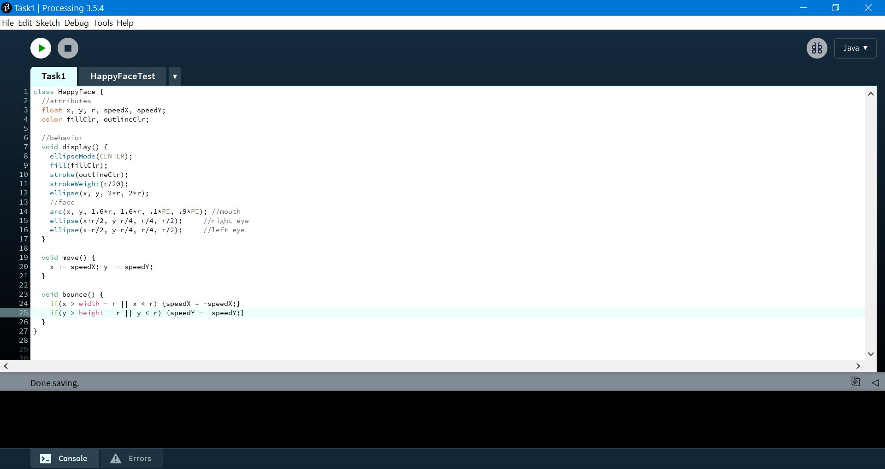
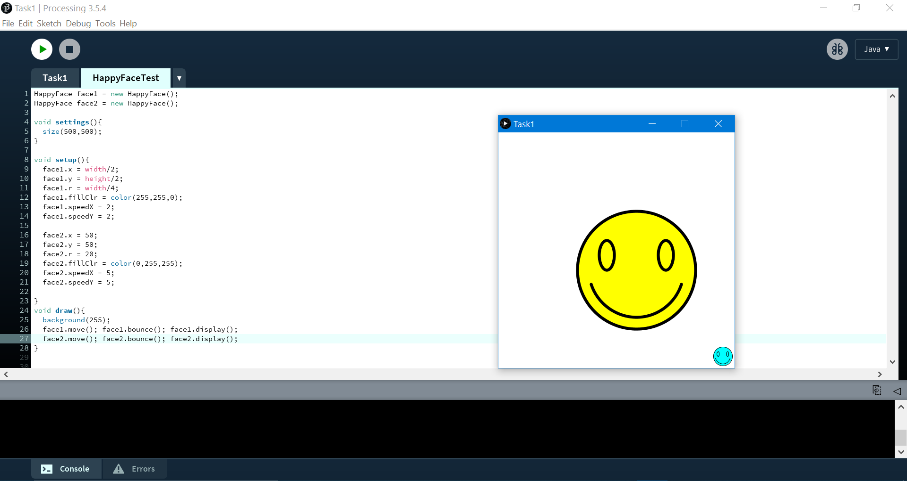
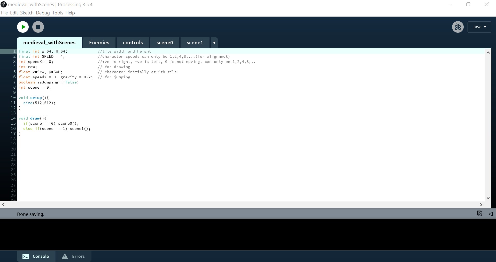
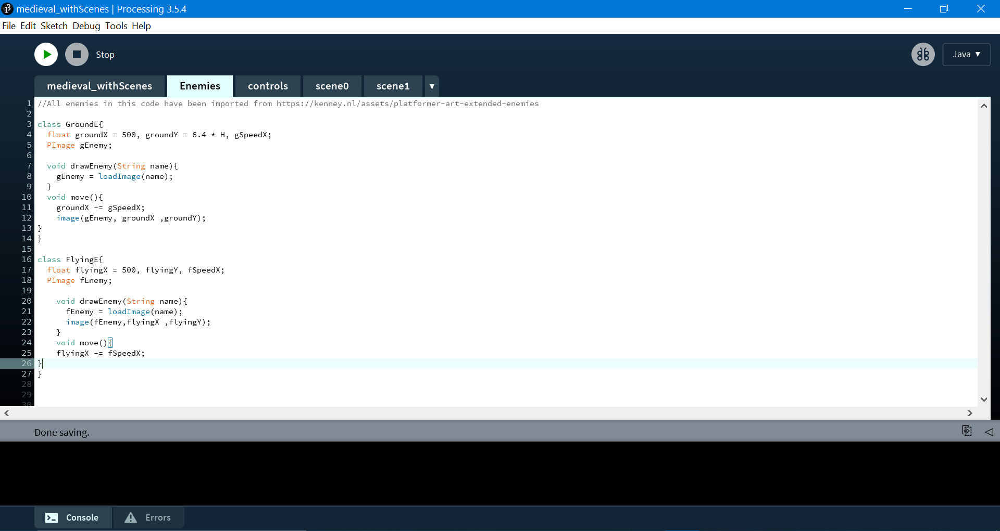
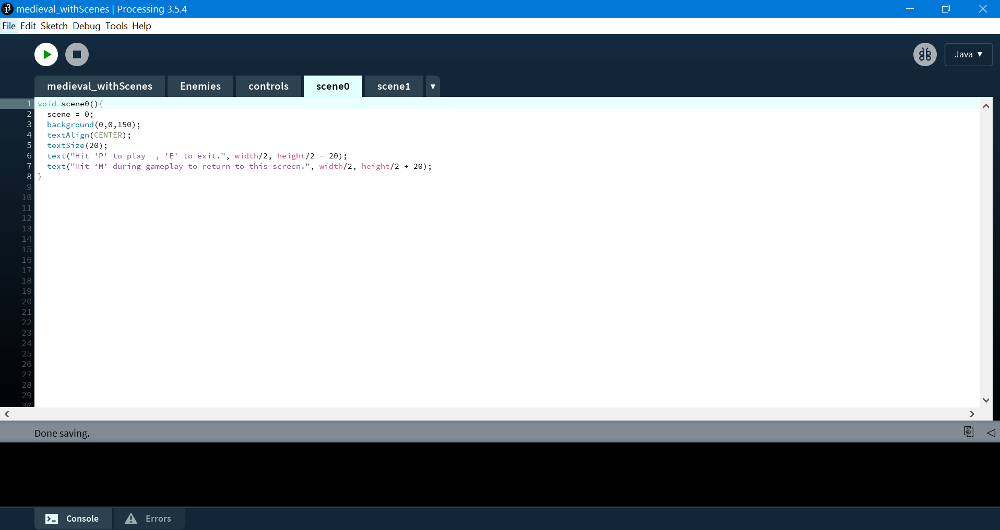
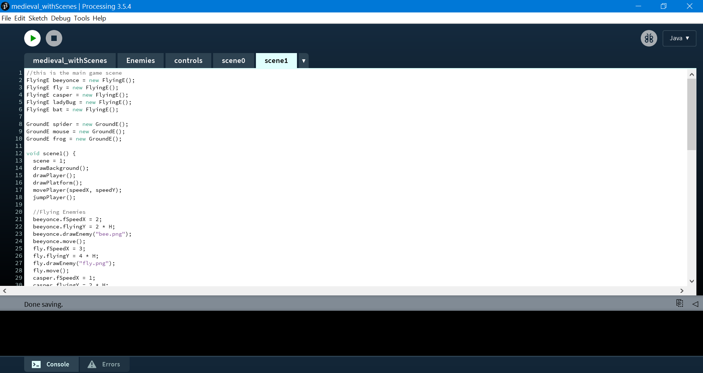
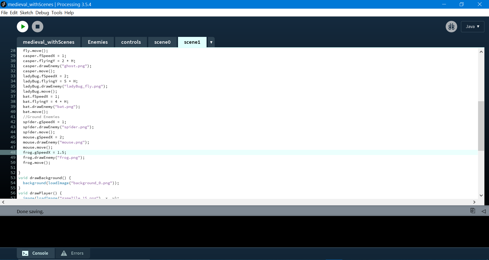
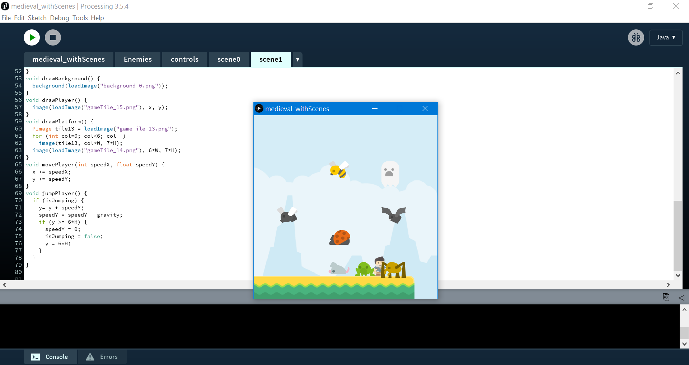

# Lecture 9 Activity

For each activity, within this README file, embed a screenshot of your code as well as the drawing that is generated after you run your code. It's okay if your screenshot doesnt show all your code.

## Task 1 - Happy Face Class Definition

Implement a class HappyFace:

- A HappyFace has position 'x', 'y', and radius 'r', all of float type.
- A HappyFace has fill color and outline color.
- Write a function display() that draws the face centered at (x,y).
  - The mouth is an arc with a diameter equal to '1.6*r'.
  - The eyes are ellipses with dimensions 'r/2 * r/4'
  - The outline’s thickness is 'r/20'

- Use the HappyFace class to create two different faces and display them on the sketch.
   - Use the dot operator to set the attributes. E.g.:
     - face1.x = width/2;
     - face1.y = height/2;
     - face1.r = width/4.
     - face1.fillColor = color(255,255,0);

*Hint: code for drawing 1 happy face in a non-OOP way:*

```
float x = 50, y = 50, r = 20;
fill(255,255,0);
stroke(255,155,0);
strokeWeight(r/20);
ellipse(x,y,2*r,2*r);                
//face
arc(x,y,1.6*r,1.6*r,.1*PI,.9*PI); //mouth
ellipse(x+r/2,y-r/4,r/4,r/2);     //right eye
ellipse(x-r/2,y-r/4,r/4,r/2);     //left eye
```

Add code to move the faces and bounce them off the sketch edges

Add a screenshot of your code and solution below this line:




## Task 2 - Improve your game

1. Start with your game from Lecture Activity 8

2. Copy the code to Lecture Activity 9 (cp)

3. If you haven’t already, organize your code so it uses tabs

4. Use object-oriented programming to create two classes:
  - Ground Enemies (or Goombas from the original Mario)
  - Flying Enemies (or Paratroopa from the original Mario)

5. Add 3 ground enemies and 5 flying enemies; they should all have different names, and be of different colours; flying enemies should be restricted to the air, and ground enemies cannot fly.

6. Remember that the original names and images are probably copyrighted, so you will have to find your own!

Add a screenshot of your code and solution below this line:







