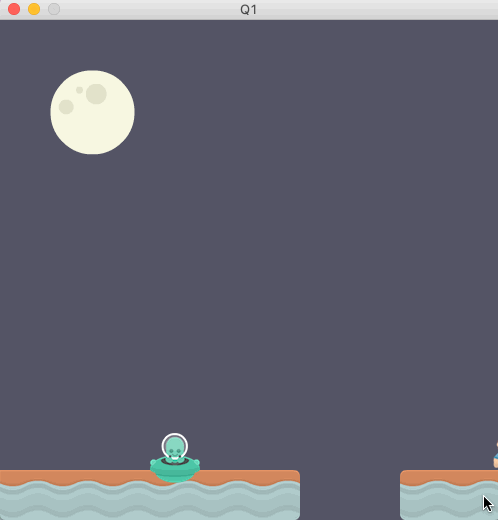

## Question 1 - Change background colour on key-stroke (5 marks)

You are provided some code in the Q1 directory, this is called the "standard template". Most of the questions below will start you off with the **same** standard template, but you will need to do different things to it. You should treat each question as an independent and separate question.

Tasks: 

a) change code so that pushing a key (e.g spacebar) randomly changes the background colour. Note: the colour must randomly change (i.e. use a random number generator).

  

 

### Rubric:

- **1 mark** for changing the background colour
- **2 marks** for changing the background colour *randomly*
- **2 marks** for controlling colour-change with a key
