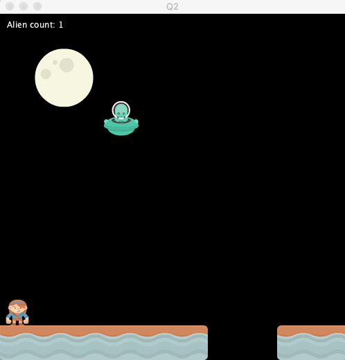

## Question 2 - Add an alien counter (8 marks)

Start with the standard template in the Q2 directory.

Tasks: 

a) Create a counter that tracks how many aliens have gone gone through since the start of the program. Every time a new alien appears, increment the counter by one.

b) Display the counter above the moon and update it to show the value of the counter.

  

 

Note: parts a and b can be done independently for part marks. For example, if you know how to do part b, but not part a, you can still display *any* counter value there for partial marks. Similarly, if you know how to do part a, but not part b, you can still get partial credit for creating a counter within Processing (even if it doesn't display).

### Rubric:

- **3 marks** creating a counter 
- **2 marks** updating the counter each time an alien appears
- **3 marks** displaying the counter value
