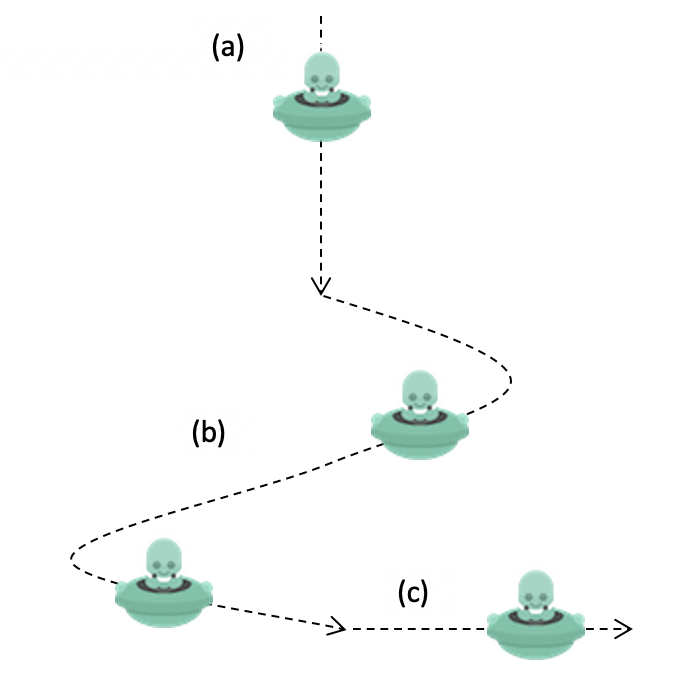

## Question 4 - Motion Paths (15 marks)

Start with the standard template in the Q4 directory.

Tasks:

a) Update the code to make the alien move along a certain path (the dotted line in figure below).
 - The motion path has three segments: (a) straight down when y <= 150, (b) sinusoidal when
y is between 150 and 400, then (c) straight to the right when y = 400. **Hint**: use a variable to record the
state of the alien movement as: (a) moving straight down, (b) moving on a sinusoidal path, or (c)
moving straight to the right. Then, use this variable to decide how the alien moves.
 - Once the alieb exits the sketch from the right, it should reappear at the top, following the same path
again. **Hint**: when the alien exits the sketch, reset its location to (150,-25) and its state to “straight
down”.
 - **You must use functions to organize your code** (update moveAlien() and create a new function to update alien state).

  

 

### Rubric:

- **3 marks** for updating the alien state based on y-location
- **8 marks** for moving the alien based on the state (2 marks for using conditional statements, 2 marks for straight down segment, 2 marks for sin-wave segment, and 2 marks for the right segment)
- **3 marks** for resetting the alien after exiting the sketch
- **1 mark** creating at least one more function (in addition to moveAlien() )
