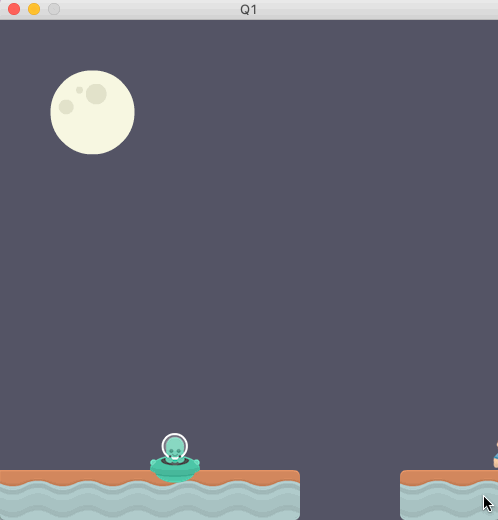
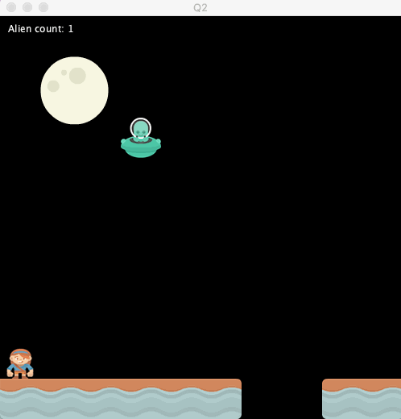
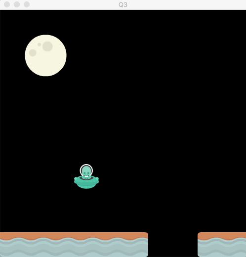

# COSC 123 Final Exam - Coding Portion (75 Marks)

**WARNING: ANY CODE/OUTPUT IN README FILES WILL NOT BE GRADED! PLEASE FOLLOW THE INSTRUCTIONS IN THE README FILES, AND AVOID CHANGING THE PROVIDED CODE, OR ADDING ADDITIONAL FILES (IF YOU DO, THOSE FILES WILL NOT BE GRADED)!**

**THE QUESTION INSTRUCTIONS BELOW ARE REPEATED IN THE FOLDER FOR EACH QUESTION.**

## Question 1 - Change background colour on key-stroke (5 marks)

You are provided some code in the Q1 directory, this is called the "standard template". Most of the questions below will start you off with the **same** standard template, but you will need to do different things to it. You should treat each question as an independent and separate question.

Tasks: 

a) change code so that pushing a key (e.g spacebar) randomly changes the background colour. Note: the colour must randomly change (i.e. use a random number generator).

  

 

### Rubric:

- **1 mark** for changing the background colour
- **2 marks** for changing the background colour *randomly*
- **2 marks** for controlling colour-change with a key

## Question 2 - Add an alien counter (8 marks)

Start with the standard template in the Q2 directory.

Tasks: 

a) Create a counter that tracks how many aliens have gone gone through since the start of the program. Every time a new alien appears, increment the counter by one.

b) Display the counter above the moon and update it to show the value of the counter.

  

 

Note: parts a and b can be done independently for part marks. For example, if you know how to do part b, but not part a, you can still display *any* counter value there for partial marks. Similarly, if you know how to do part a, but not part b, you can still get partial credit for creating a counter within Processing (even if it doesn't display).

### Rubric:

- **3 marks** creating a counter 
- **2 marks** updating the counter each time an alien appears
- **3 marks** displaying the counter value

## Question 3 - Stop the alien before the platform (5 marks)

Start with the standard template in the Q3 directory.

Tasks: 

a) Use the constrain function to ensure that the alien does not cross the platform. 

b) Once it reaches the platform, it should disappear then reappear as normal

  

 

### Rubric:

- **2 marks** for using the constrain function correctly
- **2 marks** for the alien disappearing once reaching the platform
- **1 mark** for the alien reappearing after disappearing

## Question 4 - Motion Paths (15 marks)

Start with the standard template in the Q4 directory.

Tasks:

a) Update the code to make the alien move along a certain path (the dotted line in figure below).
 - The motion path has three segments: (a) straight down when y <= 150, (b) sinusoidal when
y is between 150 and 400, then (c) straight to the right when y = 400. **Hint**: use a variable to record the
state of the alien movement as: (a) moving straight down, (b) moving on a sinusoidal path, or (c)
moving straight to the right. Then, use this variable to decide how the alien moves.
 - Once the alieb exits the sketch from the right, it should reappear at the top, following the same path
again. **Hint**: when the alien exits the sketch, reset its location to (150,-25) and its state to “straight
down”.
 - **You must use functions to organize your code** (update moveAlien() and create a new function to update alien state).

  

 

### Rubric:

- **3 marks** for updating the alien state based on y-location
- **8 marks** for moving the alien based on the state (2 marks for using conditional statements, 2 marks for straight down segment, 2 marks for sin-wave segment, and 2 marks for the right segment)
- **3 marks** for resetting the alien after exiting the sketch
- **1 mark** creating at least one more function (in addition to moveAlien() )

## Question 5 - Objected Oriented Programming (20 marks) 

Start with the standard template in the Q5 directory. I encourage you to read through the full question before starting to code!

Tasks:

a) Create a Class for ground enemies

- Ground enemies have a square body with two circles as eyes. 
- Add a 0-arg constructor to initialize an enemy AND a 2-arg constructor with speed and body colour as attributes
- Create an **array of objects** to hold the ground enemies (size 2), populate this array with a **loop** (any loop)
- Ground enemies should generate on the left side of the screen, die when they fall through the break in the platform, and then reset their position to appear from the left of the screen 
- There can be a maximum of 2 ground enemies present at a time
- Create appropriate methods as needed

b) Create a Class for flying enemies (other than aliens) 

- Flying enemies have a Triangle body with two circles as eyes. 
- Flying enemies have three attributes: speed, offset, and body colour (add more as needed).
- Add a 0-arg constructor to initialize an enemy
- Add a 3-arg constructor with speed, offset, and body colour as attributes
- Use the noise() function along with the offset attribute to control the alien's y-location
- Create an **array of objects** to hold the flying enemies (size 2), populate this array with a **loop**
- Flying enemies should bounce off the screen edges
- Flying enemies cannot die
- There can only be a maximum of 2 flying enemies present at a time
- Create appropriate methods as needed

### Rubric:

- **5 marks** for Ground Enemy Class
- **9 marks** for Flying Enemy Class
- **6 marks** for working code and correct functionality

## Question 6 - Multi-Scenes + Debugging scene (10 marks)

- In this question you will start with a Modified Standard Template where a developer has tried to implement Buttons and Scenes but the code is in a broken state with two major bugs.

Tasks: 

a) Find the two bugs and explain what the bugs are. You should add [**multi-line comments**](https://processing.org/reference/doccomment.html) to the code file(s) to identify and explain the bugs.

b) Fix the two major bugs.

### Rubric:

- **5 marks** Identifying bugs
- **5 marks** Fixing the bugs

## Q7: Course Reflection (12 marks)

This is a question that will help you reflect on some things you've learned in this course, and take a "Big Picture" view of the course content.

**You should answer all of these questions in the file called [`A_Reflection.md`](./A_Reflection.md).**

### Part 1: Beauty (3 marks)

Consider **one** computer science concept from this course that you found **beautiful**; explain the concept, and why you found it beautiful. The definition of beautiful relevant for this question is: "pleasing to the senses or mind aesthetically."

You should have a minimum of 3-5 sentences to get full marks on this question and have the following requirements:

1. Explain the concept in a way that would be understood by a first-year student that has never taken a computer science class before. 

1. Address how this beauty is similar to, or different from other kinds of beauty that human beings encounter (in nature and in the world, etc...).

### Part 2: Imagination (3 marks)

How has your imagination been enhanced as a result of taking this class? Consider how the computational ideas discussed in this term benefit the Arts, Society, Culture, and Our world. 

You should have a minimum of 3-5 sentences to get full marks on this question and you should give at least three examples.

### Part 3: Untested Content (3 marks)

In final exams, it is often not possible to test every single concept or idea discussed in the term. 

Choose a concept or an idea that you studied for, or that was part of the course, **but wasn't tested on this final exam**. Clearly state the concept or idea, and then demonstrate your understanding of the concept by explaining it in words or code at the level of a peer in the class. 

You should have a minimum of 3-5 sentences to get full marks on this question.

### Part 4: Earned Grade (3 marks)

What grade do you deserve in this course and why?

As an educator, I am very aware that learning is not easily measured by scores on tests, and exams. There are many other ways and sources of learning, and I admit that not everything can be captured by the assessments that I give you.

Pretend that there were no guidelines in the syllabus for calculating your final grade. 
Based on the work that you have done all semester, and the learning goals for the course, what grade (out of 100) do you think you have earned? 

From the syllabus, here are the course goals:

You should take this course to see how art and coding can come together to produce wondrous creations. Our ultimate goal is to give you a more fun introduction to programming by allowing you to express your creativity. You will learn programming basics such as decisions, iteration, objects, methods, and classes through the Processing language. You will also explore events, graphics, animation, 2D gaming, and file manipulation while practicing programming concepts. By completing this course, I hope you will understand programming fundamentals, have created interesting and fun programs and animations, and have the ability to continue in following computer science courses.

Note that you will **not** be graded based on how accurate your deserved grade is to your actual grade. 

Try **NOT** to focus on calculating your earned grade and avoid mentioning or referring to average grades on the labs, tests, lecture activities, or even the posted grade with your grade before the final exam. 

What is some other evidence of your learning? Consider not just what you have learned, but how much effort you put into the course (and whether that effort was productive or not), and honestly assess how much of the material you feel truly *comfortable* with.

Your answer should be in two parts:

1. A number between 0 and 100 corresponding to your earned grade in this course.
1. Approximately 3-5 sentences with an explanation/justification of your earned grade.